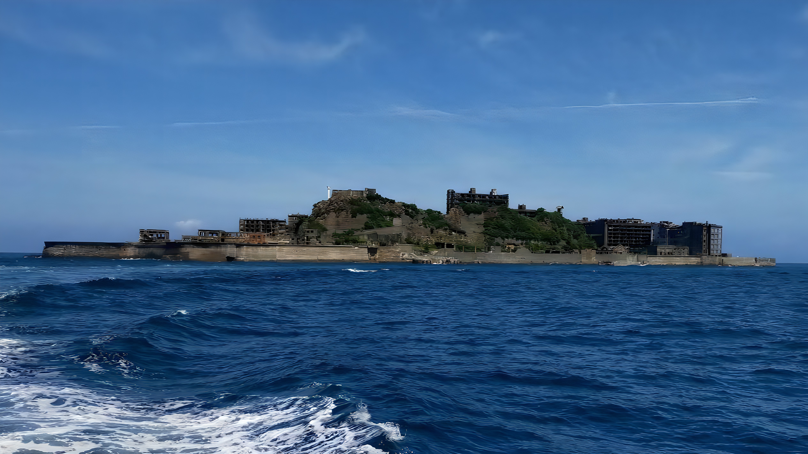

# MSA-ESRGAN Upscaler

C/C++ と OpenVINO を用いた、AI超解像(Real-ESRGAN系モデル)対応の画像拡大プログラムです。
従来の補間法(ニアレストネイバー / バイリニア / バイキュービック)に加え、ディープラーニングモデルによる超解像処理と、仕上げのアンシャープマスキング(シャープ化)を選択できます。

> **注意:** このリポジトリには学習済みモデルの重みファイルは含まれていません。[モデルの入手](#モデルの入手)の手順に従って別途ダウンロードしてください。

## 制作の背景

元々は大学の課題で、画像処理を行うC言語のみのプログラムを作成するというものでした。個人として、インターネット上には上げたくないが手元でアップスケーリングしたい画像があったことから、テーマとして「画像のアップスケーリング」を選び、AI処理以外の部分(補間法・シャープ化)を課題として作成しました。

その後、課題の範囲を超えて、AIの学習済み重みを使ってより精細にアップスケーリングしてみたいと考え、このプログラムの開発に取り組み始めました。

開発にあたって苦労したのは以下の点です。

- 使用しているPCがグラフィックボードを搭載していない一般的なノートPC(Core i5-1334U, メモリ16GB)であるため、そのスペックでも動作できるよう、できる限りの最適化を行ったこと
- 選択するモデルによってRGB値の正規化が必要な場合とそうでない場合があり、入出力のレンジを都度チェックする必要があったこと

完成させてみて、画像のアップスケーリングという処理ひとつを取っても、モデルごとの入出力仕様の違いへの対応など、思っていた以上に入り組んだ実装が必要になることを実感しました。また、C/C++はハードウェアに近い処理に優れており、こうした最適化を行ううえでは必須ともいえる言語だと感じました。

今後は、より性能の良い機器が手に入った際に、より精細な補間ができるモデルを使用できるようにしていきたいと考えています。

## 特徴

- 4種類の拡大モード(ニアレストネイバー / バイリニア / バイキュービック / AI超解像)を切り替え可能
- AI超解像は OpenVINO によるタイル分割推論に対応(大きな画像も一定メモリで処理)
- GPU推論に失敗した場合は自動的にCPUへフォールバック
- 拡大後に強度調整可能なアンシャープマスキングでシャープ化
- 拡大率に応じた処理限界(メモリ上限・JPEG規格の65535px上限)を事前チェック

## ディレクトリ構成

```
convert/
├── src/                  # C/C++ソースコード
│   ├── scaling.c         # 拡大・シャープ化のメイン処理(補間法/引数処理)
│   ├── ai_scale.cpp      # OpenVINOによるAI超解像処理
│   ├── stb_image.h       # 画像読み込み(stb_image)
│   └── stb_image_write.h # 画像書き出し(stb_image_write)
├── models/               # 学習済みモデル(要ダウンロード。詳細は下記)
├── images/               # 処理対象・処理結果の画像を置く場所
├── bin/                  # ビルド生成物(git管理外)
└── build.sh              # ビルドスクリプト
```

## 必要環境

- WSL2 (Ubuntu) または Linux環境
- g++ (C++17以降、OpenMP対応)
- OpenCV4 (`pkg-config` で検出できる状態)
- OpenVINO Runtime
- Python 3(OpenVINOのPython仮想環境用)

※上記バージョンは手元の環境に合わせて適宜置き換えてください。

### 動作確認環境

GPU非搭載の一般的なノートPCでも動作するよう最適化しています(GPU推論に失敗した場合は自動的にCPUへフォールバックします)。

- CPU: Intel Core i5-1334U(内蔵GPUのみ、専用グラフィックボードなし)
- メモリ: 16GB
- OS: WSL2 (Ubuntu24.04LTS)

上記スペックでの動作を確認済みです。専用GPUがなくても動作しますが、画像サイズやモデルによっては処理に時間がかかります。

## 環境構築

### 1. 必要パッケージのインストール

```bash
sudo apt update
sudo apt install -y build-essential libopencv-dev python3-venv pkg-config
```

### 2. OpenVINO用のPython仮想環境を作成

```bash
cd ~/convert
python3 -m venv ov_env
source ov_env/bin/activate
pip install --upgrade pip
pip install openvino
```

以降、プログラムを実行するたびに `source ov_env/bin/activate` で仮想環境を有効化してください(ターミナル左端に `(ov_env)` と表示されれば成功です)。

### 3. モデルの入手

このプロジェクトは以下のモデルを利用しています。容量の大きいモデルはリポジトリに含めていないため、各配布元から取得し `models/` 以下に配置してください。

| モデル | 入手先 | 配置先(例) |
|---|---|---|
| A-ESRGAN(本プロジェクトで使用) | https://github.com/stroking-fishes-ml-corp/A-ESRGAN | `models/A-ESRGAN/` |
| Real-ESRGAN (x4plus) | Real-ESRGAN公式リリース | `models/realesrgan/` |
| EDSR (x2/x3/x4) | OpenCV super-resolution モデル配布元 | `models/EDSR_x*.pb` |

FSRCNNおよびIntel Open Model Zoo (`single-image-super-resolution-1032`) の軽量モデルはリポジトリに同梱しています。

### 4. AIモデルパスの指定

AI超解像モード(`method=3`)を使うには、モデルの `.xml` パスをコマンド引数(第5引数)で渡すか、環境変数で指定します。本プロジェクトでは A-ESRGAN のモデルを使用しています。

```bash
export ESRGAN_MODEL_PATH=~/convert/models/A-ESRGAN/A_ESRGAN_Multi.xml
```

`~/.bashrc` に追記しておくと、毎回設定し直す手間が省けます(`echo 'export ESRGAN_MODEL_PATH=...' >> ~/.bashrc` の後、`source ~/.bashrc` で反映されます)。

### 5. ビルド

ソースコード(`ai_scale.cpp` / `scaling.c`)を変更した場合のみ、以下でビルドします。

```bash
./build.sh
```

成功すると `bin/upscale_app` が生成されます。

## 使い方

```bash
cd ~/convert
source ov_env/bin/activate
./bin/upscale_app [入力画像パス] [拡大率] [補間モード] [シャープ化強度] [AIモデルパス(任意)]
```

### 引数

| 引数 | 説明 |
|---|---|
| 第1引数 | 処理したい元画像のパス(`images/` に配置) |
| 第2引数(拡大率) | 補間モードは任意の値、AI超解像モードは `2.0` / `3.0` / `4.0` のみ指定可 |
| 第3引数(補間モード) | `0`: ニアレストネイバー / `1`: バイリニア / `2`: バイキュービック / `3`: AI超解像 |
| 第4引数(シャープ化強度k) | `0.0` で無効、`1.0`〜`2.5` 程度で輪郭強調 |
| 第5引数(AIモデルパス、任意) | 省略時は環境変数 `ESRGAN_MODEL_PATH` を参照 |

### 実行例

```bash
./bin/upscale_app images/hashima.jpg 4.0 3 1.5
```

処理が完了すると、入力画像と同じフォルダに `_Scaled_Sharpened.jpg` が付いた画像が生成されます。

### 実行結果例

軍艦島(端島)の写真をAI超解像(A-ESRGAN, 4倍)+シャープ化1.5で処理した結果です。



### 作業終了時

```bash
deactivate
```

## 補足

- タイル分割処理(64px単位、マージン16px)により、大きな画像でもメモリを抑えて推論します。
- モデルの出力レンジ(0〜1 / 0〜255)は輝度の最大値から自動判定しています。
- GPU推論に失敗した場合は自動的にCPUにフォールバックします。

## Credits / 謝辞

このプロジェクトは以下のモデル・ライブラリを利用しています。

- [A-ESRGAN](https://github.com/stroking-fishes-ml-corp/A-ESRGAN) (BSD 3-Clause License, Copyright (c) 2021, A-ESRGAN-Team)
- Real-ESRGAN
- OpenCV EDSR super-resolution モデル
- Intel Open Model Zoo — single-image-super-resolution-1032
- [stb_image / stb_image_write](https://github.com/nothings/stb)
- [OpenVINO](https://github.com/openvinotoolkit/openvino)
- [OpenCV](https://opencv.org/)

各モデル・ライブラリのライセンスは、それぞれの配布元の内容に従います。

## License

このリポジトリ内の独自コード(`src/` 以下)は [MIT License](./LICENSE) の下で公開しています。
利用しているモデル・ライブラリについては、各配布元のライセンスを個別にご確認ください(上記Credits参照)。
